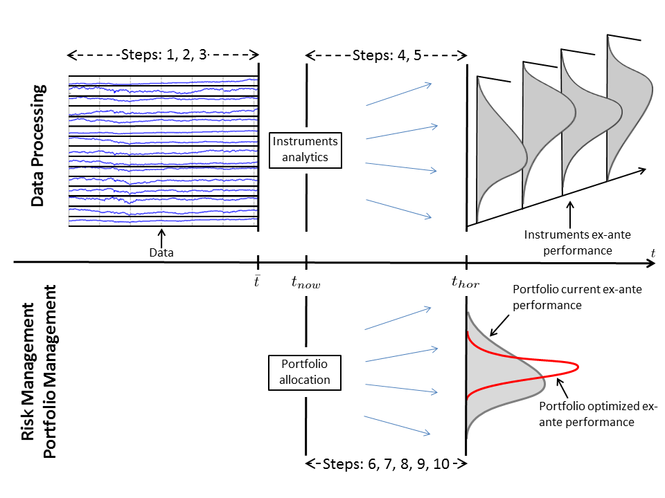
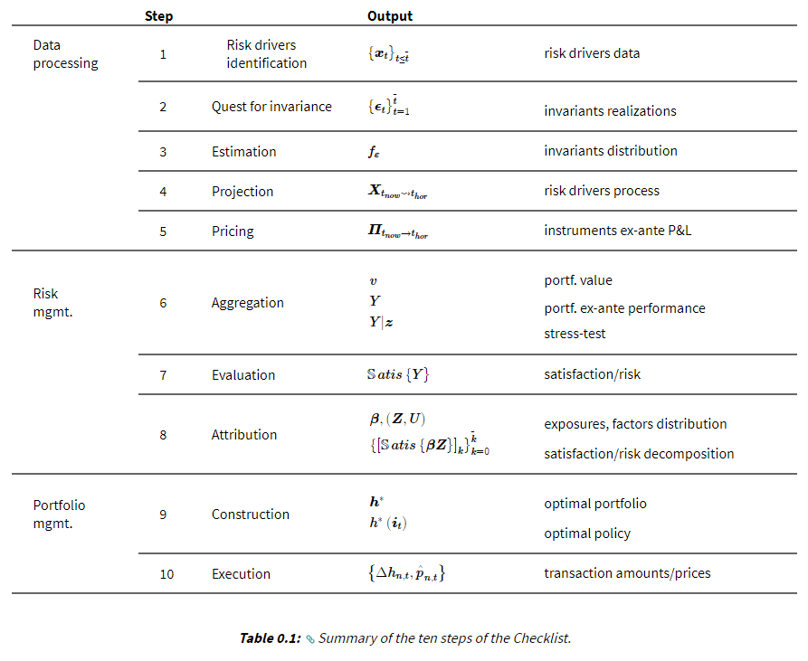

# arpmRes
Advanced Risk and Portfolio Management Resources

# Overview

The following material is divided into 4 modules:
  1. Data Science for Finance
  2. Financial Engineering for Investment
  3. Quantitative Risk Management
  4. Quantitative Portfolio Management

It covers the most advanced quantitative techniques in data science & machine learning, market
modelling, factor modelling, portfolio construction, algorithmic training, investment risk management, liquidity
modelling and enterprise risk management.

# Content

The "Checklist" consists of 10 sequential steps to model, assess and improve the performance of the portfolio. By
following these steps in the checklist, one can avoid common pitfalls and ensure not to miss important features in
the models. The 10 sequential steps are summarised graphically:

The checklist can be explained by examining a portfolio at time $t_{now}$. The focus in on the performance and we
have two goals:
 1) risk management: measure the risk between $t_{now}$ and the investment horizon $t_{hor}$
 2) portfolio management: optimise future performance over horizon

To achieve this, you have to accumulate all data up to $t_{now}$ and this involves the following 10 steps.

1. **Data Processing (steps 1-5)**: These steps show how to transform raw data for different financial instruments into
tractable time series; how to perform estimation on such time series using econometric techniques; and how to revert
back to the joint predictive distribution of the performance of each instrument over the future investment horizon.

2. Risk Management (steps 6-8): How to aggregate the ex-ante performance of each instrument into a portfolio
performance; how to evaluate the riskiness of a portfolio using metrics such as VaR, Tracking-Error etc. or by
performing stress-testing; and how to attribute portfolio risk to different sources.

3. Portfolio Management (steps 9-10): How to construct a portfolio using simple mean-variance or more complex
objectives; how to strengthen the construction process to address estimation risk; how to optimally execute trades; and
how to perform dynamic rebalancing in multi-period strategies.

# Installation
To install the repo, start a new project and clone the repo. Then, do the following steps:

1. Setup the virtual environment for python. To do this, go to File -> Settings -> Project:arpmRes ->
Project Interpreter -> Show All (dropdown) -> Add -> New environment (check 'Inherit global site-packages') -> OK

2. Install all package dependencies. In the Terminal: pip install -r requirements.txt

